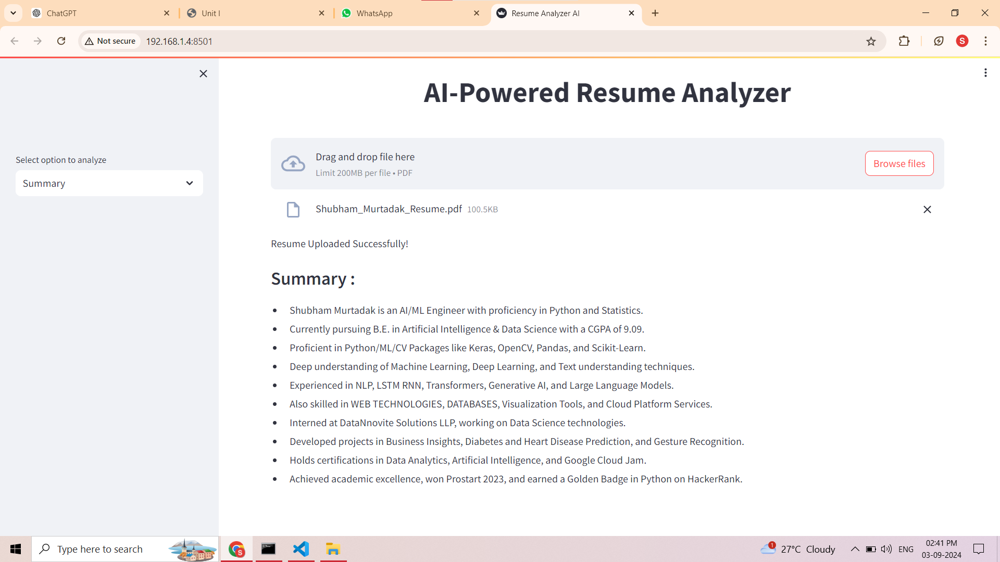
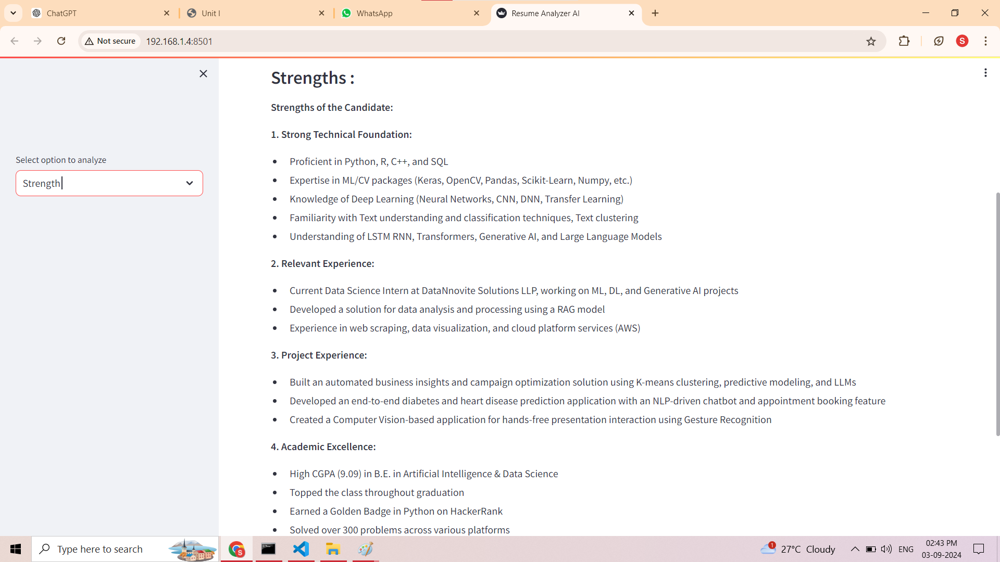
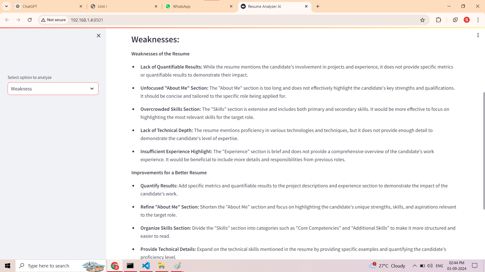
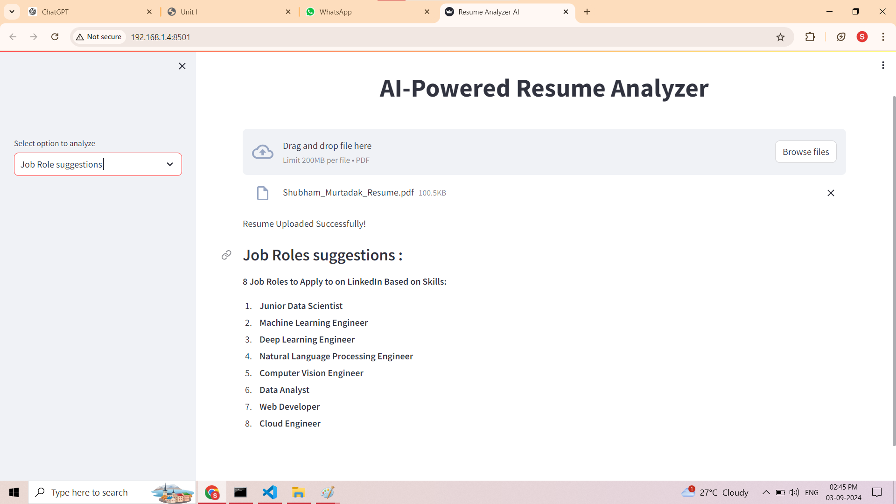

# ResumeAnalyzer-Pro
## App Demo

 

Resume Analyzer is a Streamlit web application designed to assist users in analyzing resumes. It allows users to upload a resume in PDF format, and based on the uploaded resume, it provides summarized information, strengths, weaknesses, and job role suggestions.

## Features

- **Upload Resume**: Users can upload their resume in PDF format.
- **Summarize**: The app summarizes the content of the uploaded resume using OpenAI Codex.
  
- **Strengths Extraction**: Extracts strengths from the summarized text.
  
- **Weaknesses Extraction**: Extracts weaknesses from the summarized text.
  
- **Job Role Suggestions**: Provides suggestions for job roles based on the resume.
  

## Installation

1. Clone this repository:

    
bash
    git clone https://github.com/Sagarkeshave/ai_resume_analyze.git

2. Navigate to the project directory:

    
bash
    cd ai_resume_analyze

3. Install the required dependencies:

    
bash
    pip install -r requirements.txt

4. Obtain a Google API key and enter it when prompted.

## Usage

1. Run the Streamlit app:

    
bash
    streamlit run main.py

2. Access the app via your web browser (typically at http://localhost:8501).

3. Upload your resume in PDF format using the provided file uploader.

4. Click the "Summarize" button to generate a summary of your resume.

5. Review the summarized text, extracted strengths, weaknesses, and job role suggestions.
